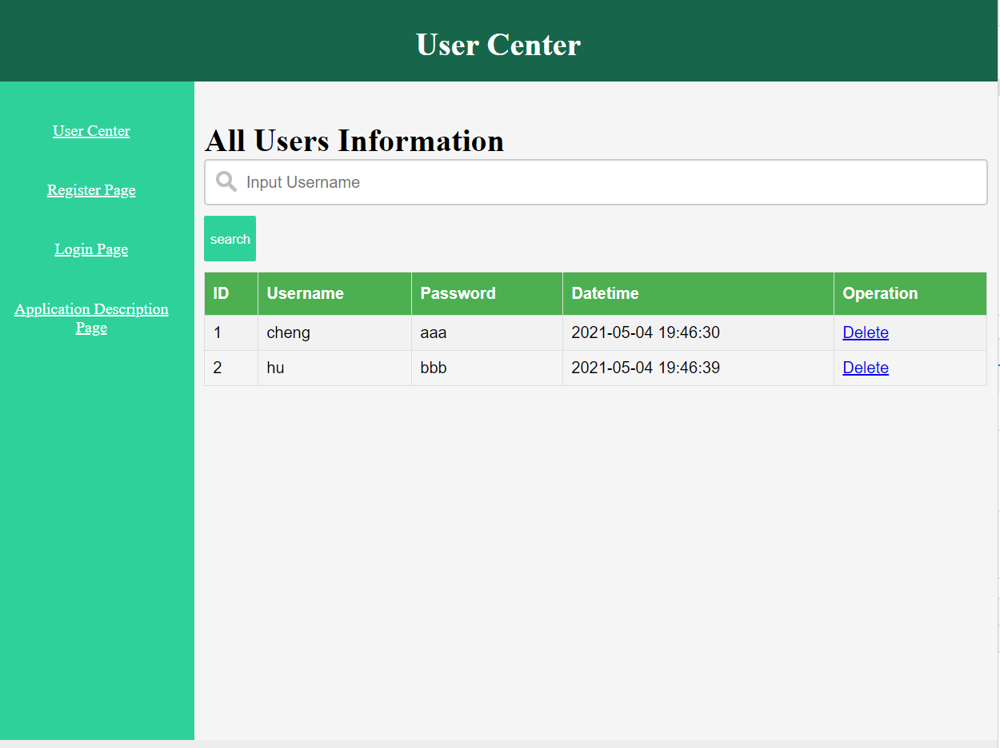
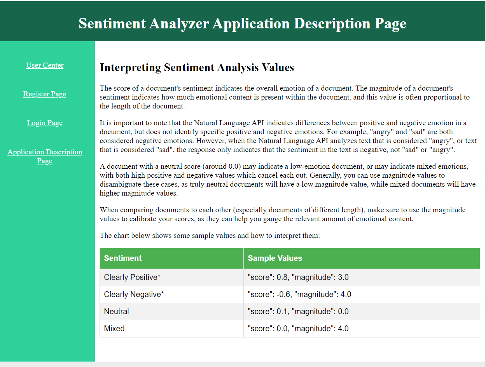
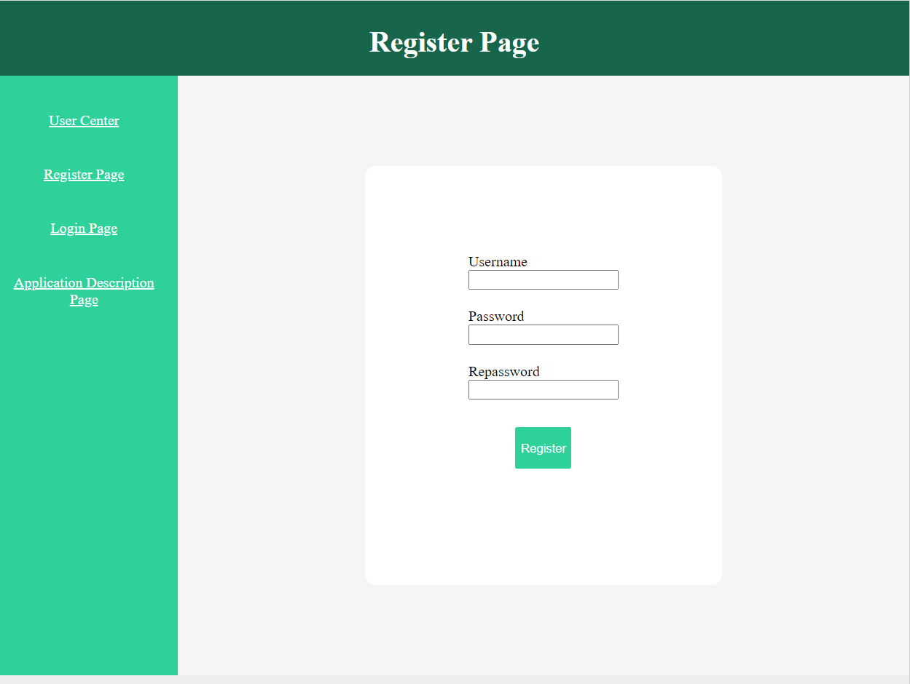
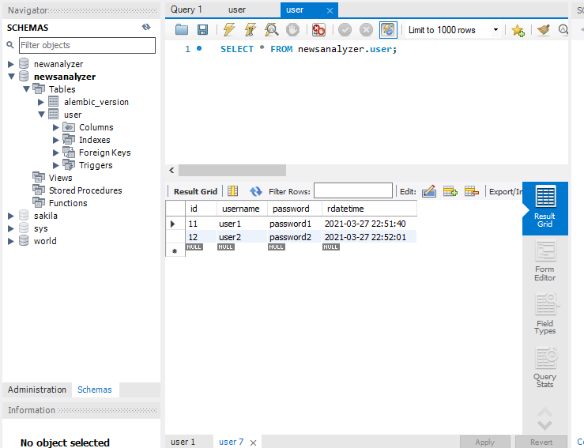
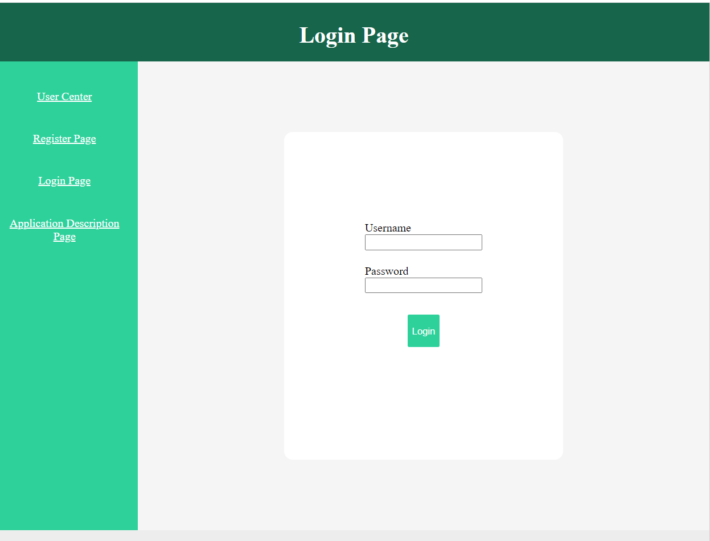
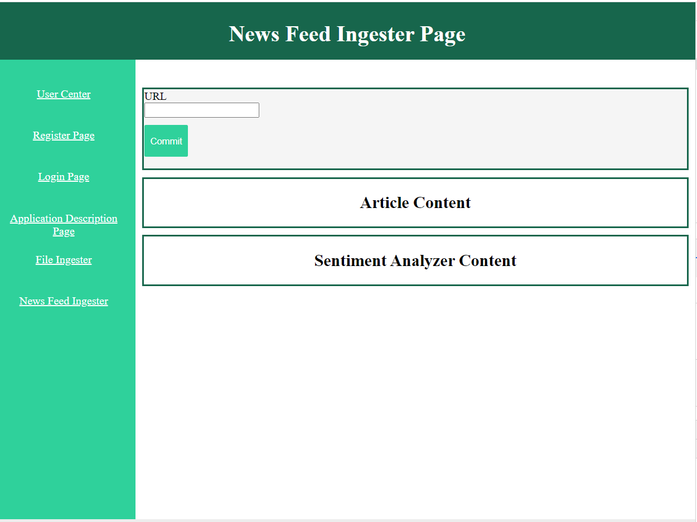
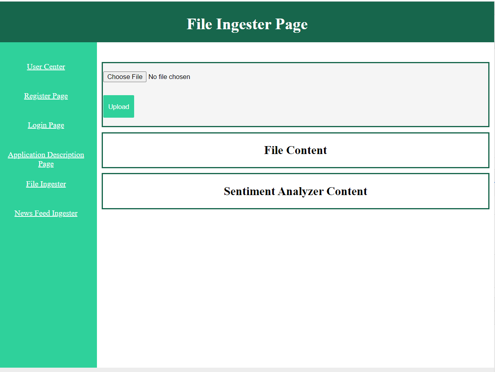
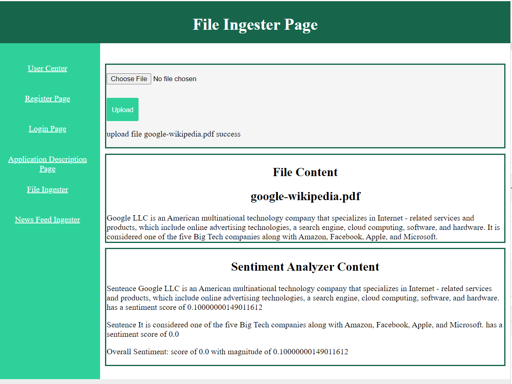

# News Analyzer
Author: Lin Cheng, Yuhan Hu

## Product Mission
Ingest and discover content to help journalist investigate stories

## Modules Implement
1. User register module
2. MYSQL database module
3. User login module
4. Upload file module
5. Extract file module
6. User info module
7. Sentiment analysis module

## Project Architructure

- apps  
    - __init__.py                                               **------// default file connects other blueprint parts to main app.py**
    - user                                                      **------// user part folder**
        - __init__.py                                           **------// default file for user part**
        - view.py                                               **------// blueprint for user part, store all user routes**
        - model.py                                              **------// User class in order to store info for each user**
    - article                                                   **------// article part folder**
        - extract_file.py                                       **------// extract file from PDF to txt**'
        - sentiment_analysis.py                                 **------// analyze sentiment of file/text**
- static  
    - css                                                       **------// store css styles**
    - images                                                    **------// store images**
    - js                                                        **------// store javascript**
    - files                                                     **------// store the uploaded files**
- templates  
    - user
        - register.html                                         **------// register page**
        - login.html                                            **------// login page**
        - center.html                                           **------// user center page**
        - uploadFile.html                                       **------// file page**
- app.py                                                        **------// main file**

## Introduction
### Run 'python3 app.py runserver' and direct to User Center Page

### Application Description Page

### Register Page

### MYSQL

### Login Page

### News Feed Ingester Page

### File Ingester Page

### Sentiment Analyzer

## pre-requirements install：  
1. cd your-project
2. py -m venv env // create venv in env
3. .\env\Scripts\activate  // active venv
4. deactivate  // stop venv
5. pip install virtualenv
6. pip install flask
7. pip install flask-script
8. pip install pysql
9. pip install flask-sqlalchemy
10. pip install flask-migrate
11. pip install PyPDF2
12. pip install google-cloud-storage
13. pip install --upgrade google-cloud-speech

run pip list to watch pip list

## Steps
1. create settings.py and add MYSQL database name
2. create database newdatabase charset = utf8  // create database in MYSQL WORKBENCH\
3. create static folder to store css/files/js，templates folder to store HTML，app.py to active whole project
    1. in app.py
        1. create app.run()
        2. add Manager(app=app)
        3. add create_app() function
4. create apps folder
    1. create __init__.py and add create_app()
5. add database module
    1. create exts folder，create __init__.py and define db
    2. in apps/__init__.py, in create_app() init db  
    3. manage db by using command：create migrate in app.py, add db in manager, change app.run() to manager.run() in main()
    4. create user,article folder in apps folder
    5. in user folder create __init__.py, view.py, models.py  
    6. in models.py create User class and extends db.Model  
    7. in app.py add User, run 3 commands in terminal 
        1. python3 app.py db init      // init migrations folder
        2. python3 app.py db migrate   // create version file
        3. python3 app.py db upgrade   // add user table into new database
6. add login module
    1. in apps/user/view.py add blueprint
    2. add user_center router
    3. add register router
    4. add logi router
    5. in templates, create user folder and create center.html,register.html,login.html in it
    6. in apps/__init__.py, in create_app() register blueprint
7. add file_upload module
    1. add fileUpload.html
    2. add file_upload router
    3. add extract_file.py to transfer uploaded PDF file to txt file and store it in static/files folder
8. add sentiment_analysis module
    1. in apps/article folder add sentiment_analysis.py
    2. in file_upload router add sentiment_analysis.py to analyze sentiment of a txt file
    3. transfer all data back to fileUpload.html and present them

## Different Versions of Explaination
1. Chinese version [link to Chinese version!](explain/chinese_version.md)
2. English version [link to English version!](explain/english_version.md)
